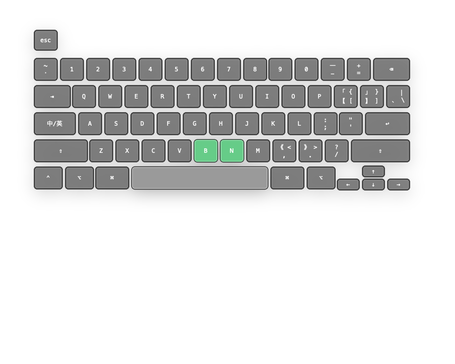
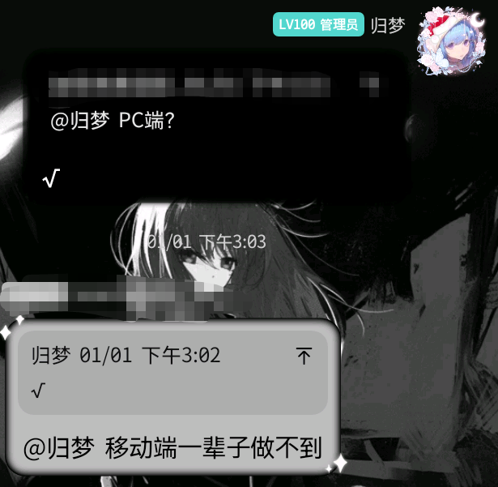

## 前言

目前 Milthm 在 PC 端的玩家群体非常小，甚至很多玩家根本不知道这款游戏有 PC 版本。因此，我想写一篇文章，简单介绍一下它的 PC 端体验与独特机制。

（PC 版可在 Steam 免费下载，支持 Windows、macOS 与 Linux 平台）

---

## 判定机制

### 移动端判定方式

- **判定范围**：  
  轨道上以判定点为中心的一定范围内均可触发判定（实际上判定范围非常宽松）

- **Tap**：  
  音符落到判定点时，在判定范围内单击一次即可

- **Drag**：  
  音符落到判定点时，判定范围内至少有一个触点即可

- **Hold**：  
  - **头判**：与 Tap 判定一致  
  - **尾判**：设 Hold 持续时间为 [a, b]，则在此区间内需始终存在至少一个触点（按下状态）  
  - **特殊情况**：当场上存在多个 Hold 时，若 Hold_A 区间为 [a, c]，Hold_B 区间为 [b, d]，且 a < b ≤ c < d，则 Hold_B 只需在 [a, d] 区间内始终有至少一个触点即可

---

### PC 端判定差异

PC 端的判定逻辑与移动端基本一致，**唯一区别在于「判定范围」**。

在 PC 端，可触发判定的按键包括：

- A–Z（26 个字母键）
- 0–9（10 个数字键）
- ↑↓←→（4 个方向键）
- 回车键、空格键
- ESC 键（仅用于暂停）

共计 **42 个可判定按键**。

只要按下上述任意按键，即可无视轨道上的判定范围，直接触发音符判定，也就是所谓的 **「全屏判定」**。

---

## 实际游玩

在PC端，因为「全屏判定」的机制，导致如果处于密集的note中 只要存在一次多点或漏点，很容易连带其之后一整段全部崩盘

所以游玩时首先要注意需按下的note数量。

一个非常实用的思路是：  
**模拟移动端的操作方式，将自己按下的按键在脑海中映射到屏幕轨道上。**

---

### 映射

Milthm 的所有常规谱面（dz / sk / cb）以及多数追加难度谱面（如 CL）均为双指谱。  
但在 PC 端，若只用两个按键模拟双指操作，会面临两个问题：

1. 键盘没有“位移”操作；
2. 按键按下与抬起之间存在物理延迟。

因此，我个人的建议是：将谱面拆解为类似 4K 的键位分配，将操作分摊到多个按键上。

#### 示例 1

这是一个典型的密集散打片段，如果只靠两根手指会非常吃力。  
但如果将其拆解为类似 `kjdfjkjdfk` 的指法分配，难度会明显下降。

（实际游玩可参考我打的 [骤雨](https://www.bilibili.com/video/BV1SqrCB3EDQ/?t=115)）

#### 示例 2

  
  

以 LiFE Garden (Extended Mix) [CLear] 的 287–320 Combo 段落为例：

在拍掉 287–291 的两个多押后，右手可以持续轮指，左手单击处理其中的双押部分，直到左手点击 314 Combo的长条后，右手进行两轮 `j_k l` ，即可稳定通过。

---

## 其他玩法：

由于“全屏判定”的特性，PC 端可以实现一些移动端无法做到的玩法，例如：

### 单指

如上图所示，你甚至只需要 **B / N / 空格** 三个键，就能打完整个 Milthm！

- **双押**：按住 B 和 空格  
- **交互**：手指在 B 与 N 之间快速滑动（Hold 键不会因此断连）  

只要节奏掐准，单指也能轻松制霸 Milthm（确信）。

（下图为我目前的单指存档查分图，~~还在持续推分中~~）

---

## 其他的一些话

如图

我自己主玩的是PC端（因为家里ipad air1的ios版本不支持milthm），但经常遇到很多人见到「全屏判定」就会认为「PC端非常简单」

我不知道这是何意味，是谁给你们的自信

PC端的难度在我个人看来是比移动端稍难一些的，并不存在「非常简单」「换到移动端一辈子做不到」，但也不至于超出很多

至少在目前来说 我没有见到任何一个ranker实际玩过PC端后认为他简单的

目前 PC 端的高分段玩家仍然寥寥无几，也远未形成像移动端那样的竞技生态。

但正因如此，它才更值得被看见、被尝试、被认真对待。
